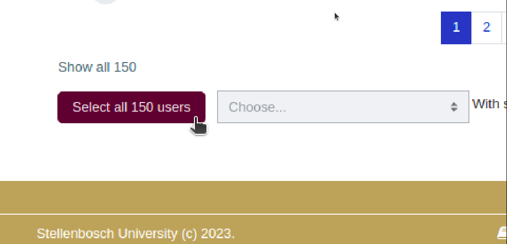
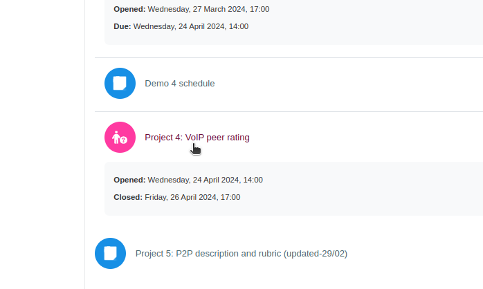
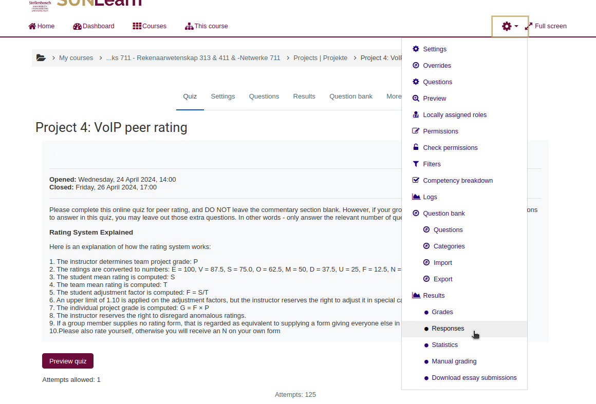
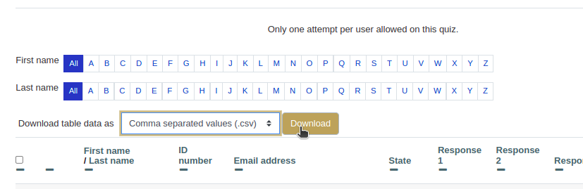

# Peer Evaluation Program (PEP)
## `Before you begin`
This program requires two dependencies that are freely and easily available to download through the terminal. The following commands will create the environment and install the dependencies on a Linux system. Just follow the relevant commands for your Operating system.

### Installing Dependencies
```bash
sudo apt-get update
sudo apt-get upgrade -y
sudo apt-get install python3 -y
sudo apt-get install python3-pip -y
```
Note that if you want to run the GUI, your python installation should have it already installed. If not you will need to install `python3-tk` as well, and might need to check your _td/tk_ packages.

Now you can go ahead and install the required python packages through pip:
```bash
pip3 install -r src/dependencies.txt
```
This _dependencies.txt_ file contains the two dependencies required: `pandas` and `openpyxl`.

Assuming your working directory is the root of the project PEP, you can now go ahead and run the program.

### Getting the Relevant Files from SUNLearn
You will need two files from SUNLearn to run PEP:
1. The file mapping students to groups.
2. The file containing the peer review responses.

#### Getting the Group File
Go to the participants tab on sunlearn and scroll to the bottom. Click on the `Select all <#> students` button and specifically select the `xlsx` option for download. The reason for this file format is due to it being the only download option at the start of the project. Future plans are to support `csv` files as well.



#### Getting the Peer Review File
Go to the online quiz that was used for the peer review. 



Then navigate to the `Responses`.



Finally, click on the download button for specifically the `CSV` format.



And now you should have the two files needed to run PEP. Please note that the group file has the `xlsx` extension and the peer review file has the `csv` extension.
 
## `How To Run PEP` 
There are two interactive mode to use PEP:
- Graphical User Interface (GUI)
- Command Line Interface (CLI)

### `GUI`
To run the GUI, run the following command:
```bash
python3 app.py run
```
The GUI using Tkinter will open and you can follow the onscreen instructions from there.

### `CLI`
The CLI usage is a bit more involved. There are two ways in which you can use the CLI:

- By hardcoding the file paths at the bottom of the `src/mark_ratings.py` file and running the following command:
    ```bash
    python3 app.py cmd
    ```
- Or by providing the three file paths as arguments in the terminal:
    ```bash
    python3 app.py cmd <group> <rating> <output>
    ```

### `NB: TAKE NOTE OF SPECIFIC ERROR MESSAGE`
If you encounter an error message (displayed in the terminal) that indicates that Groups, Surnames or other column names are not found, please check the top of the file `src/mark_ratings.py` and ensure that the column names are correctly mapped to the correct column names in the input files. This is due to different modules giving different column names to the same data. Future planned updates are to map these column names in the GUI, and create a config.txt file for cmd usage. _`For now, feel free to change anything in the code to suit your needs.`_

---
---
---
---

## README TODO:
1. How to use PEP software.
    - Install using Linux and Mac.
    - Install using Windows (WIP...).
    - GUI and CLI usage.
    - Explain output files.
2. How to setup SUNLearn groups allocation and how to export the resulting file.
3. Format of group allocation file required for PEP if manual allocation is done.
4. How to setup SUNLearn peer review quiz and how to export the resulting file.
5. Format of peer review file required for PEP if manual peer review is done.
1. Explain any misc functions and features, such as self-learning group allocation.
---

## Features TODO:
1. ~~Add ability to toggle option for students to rate themselves.~~ &check;
2. ~~Add an Excel spreadsheet file as an output to both check internal calculations and for users to see how the calculations are done. This file should take on the familiar format of manually calculating the grades as done in the past.~~ &check;
4. ~~Add an Excel spreadsheet file as an output for all worded reviews in order to easily check for group member names and ratings.~~ &check;
1. ~~If group file is absent, self-learn and associate members to groups based on peer review.~~ &check;
3. Start/Expand/Finish README
1. Check all given member ids before attempting to correct them (Potentially reducing initially flagged students).
1. Record and display reason for flagging students.
1. Map Column names in GUI.
1. Sunlearn was updated: Change group file support from xlsx to csv.
1. Add a config file for CLI usage.
1. Perhaps move GUI from Tkinter to Plotly Dash due to better support for data visualization and version control.
1. Add a field to ignore certain groups (such as Admin, as to not bloat the output file).
---